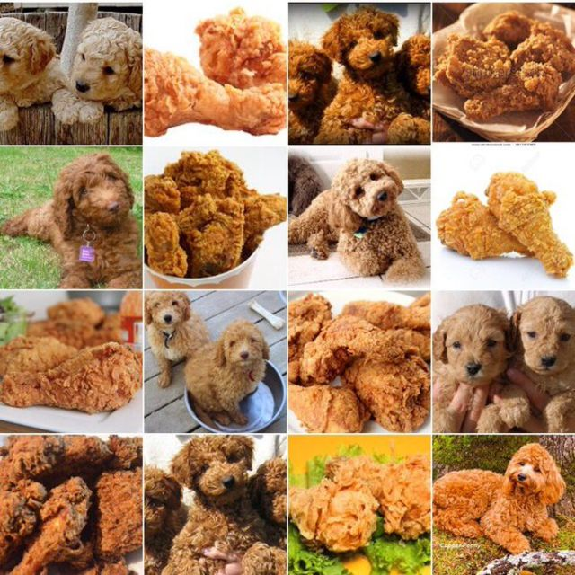
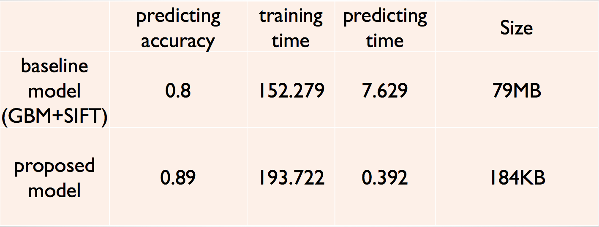
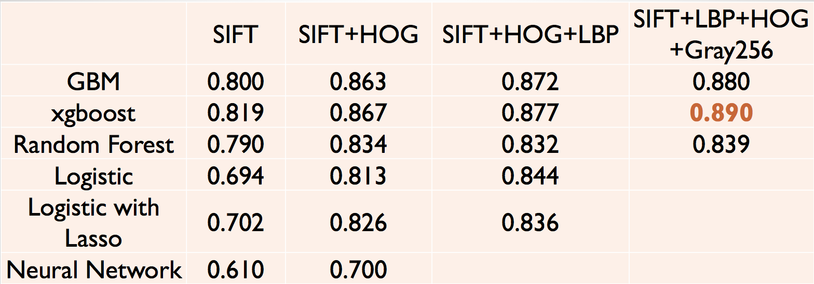
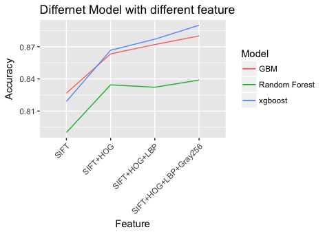

# Project: Dogs, Fried Chicken or Blueberry Muffins?



### [Full Project Description](doc/project3_desc.md)

Term: Fall 2017

+ Project summary: In this project, we created a classification engine for images of dogs versus fried chicken versus blueberry muffins. ([Main.Rmd](doc/main.Rmd) and [Main.pdf](doc/main.pdf))

  + Baseline model: GBM with SIFT feature, accuracy 80%
  
  + Proposed model: XGBoost with SIFT+ SIFT+HOG+LBP+Gray256 feature, accuracy 89%
  
+ Project details: First, we researched on several classification medels including gbm, xgboost, random forest, logistic regression, lasso, nueral network, svm and cnn. Next, we test different ways of feature extraction including sift, hog, pca, lbp and cnn and use the features we got to work with different models. Finally, we found the most efficient solution of this problem is using model xgboost and feature sift+hog+lbp+gray256.

+ Quick Access: In case you get lost in the main file, this folder contains everything you need to run the advanced model ([Final_model](lib/Hongyang_Final))

### Be Careful about the order of the features: SIFT(5000)+HOG(448)+LBP(59)+Gray(256)

Comparison of baseline and proposed model:	


Performance of different models and different features:






Following [suggestions](http://nicercode.github.io/blog/2013-04-05-projects/) by [RICH FITZJOHN](http://nicercode.github.io/about/#Team) (@richfitz). This folder is orgarnized as follows.

```
proj/
├── lib/
├── data/
├── doc/
├── figs/
└── output/
```

Please see each subfolder for a README file.
